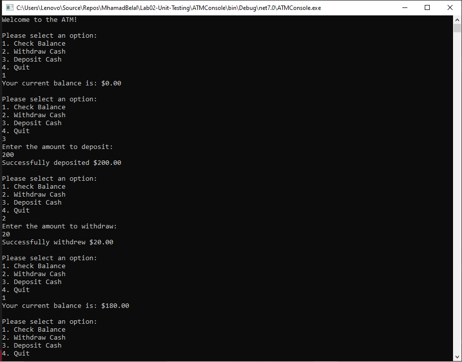

# Lab02-Unit-Testing

The ATM Console Application is a mock implementation of an ATM machine. It provides basic functionality such as checking the account balance, withdrawing cash, and depositing cash. The application is built using Test Driven Development (TDD) and follows the principles of clean code and SOLID design.



## Table of Contents

- [Features](#features)
- [Usage](#usage)
- [Example Usage](#example-usage)
- [Additional Details](#additional-details)

## Features

The ATM Console Application includes the following features:

- **Check Balance:** View the current balance of your account.
- **Withdraw Cash:** Withdraw a specified amount of cash from your account.
- **Deposit Cash:** Deposit a specified amount of cash into your account.

## Usage

Follow the steps below to use the ATM Console Application:

1. Clone the repository:

   ```shell
   git clone https://github.com/your-username/atm-console-app.git

2. Open the solution in your preferred IDE.

3. Build the solution to restore dependencies and compile the code.

4. Run the application. The console interface will be displayed, prompting you to select an option.

5. Follow the on-screen instructions to interact with the ATM application.


## Example Usage

Here are some examples of how to use the ATM Console Application:

1. Checking Balance:

	Select option 1 from the menu. The current balance of your account will be displayed.

	```shell
	Please select an option:
	1. Check Balance
	2. Withdraw Cash
	3. Deposit Cash
	4. Quit

	> 1
	Your current balance is: $1000.00

2. Withdrawing Cash:

	Select option 2 from the menu and enter the amount you want to withdraw. If the withdrawal is successful, the withdrawn amount will be displayed.
	
	```shell
	Please select an option:
	...
	> 2
	Enter the amount to withdraw:
	> 500.00
	Your Balance now is $500.00

3. Depositing Cash:

	Select option 3 from the menu and enter the amount you want to deposit. If the deposit is successful, the deposited amount will be displayed.
	```shell
	Please select an option:
	...
	> 3
	Enter the amount to deposit:
	> 200.00
	Your Balance now is $700.00

4. Quitting the Application:

	Select option 4 from the menu to exit the application.
	```shell
	Please select an option:
	...
	> 4
	Thank you for using the ATM. Goodbye!

## Additional Details

Here are some additional details about the ATM Console Application:

* The ATM Console Application uses a static public Balance variable to store the current balance of the account. This variable is accessible within the Program class and allows the user interface methods to access and update the balance as needed.
* The application enforces certain rules, such as not allowing withdrawals that exceed the available balance and not accepting negative amounts for deposits.
* Unit tests have been implemented using the xUnit testing framework to ensure the correctness of the application's functionality.
* The application provides a simple and intuitive command-line interface for users to interact with.


